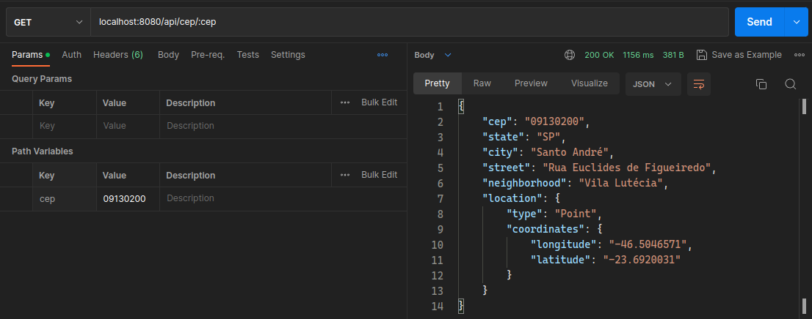

# cepsearch

## About

API developed for consumption of BrasilAPI. In it, OpenFeign was used to integrate REST Clients. An in-memory database
for caching, Redis, was also used. Along with other technologies like Docker and the docker-compose plugin. The API was
developed to practice programming and to study.

## Screenshot

## Requirements

1. [Docker](https://docs.docker.com/engine/install/)
2. [Docker-compose](https://docs.docker.com/compose/)

## Get Started

### Running the application with docker-compose

1. Clone the repository or download the source code

        git clone https://github.com/WeversonL/cepsearch.git
        cd cepsearch

2. Start with docker-compose

        docker-compose up -d

3. If you want to view the interactive swagger, access the url below in your browser

        http://localhost:8080/api/swagger-ui/index.html#/

4. Make a search by sending the desired zip code as QueryParam, in your desired client. Below I leave an example curl

        curl --location --request GET 'localhost:8080/api/cep/17560-246'

### Other information

1. To terminate the containers, you can run

        docker-compose down

⚠️ Still in development

## License

`cepsearch` is released under the [GNU General Public License, Version 2](LICENSE)

        Copyright (C) 2022 Weverson Lemos

        This program is free software; you can redistribute it and/or
        modify it under the terms of the GNU General Public License
        as published by the Free Software Foundation; either version 2
        of the License, or (at your option) any later version
