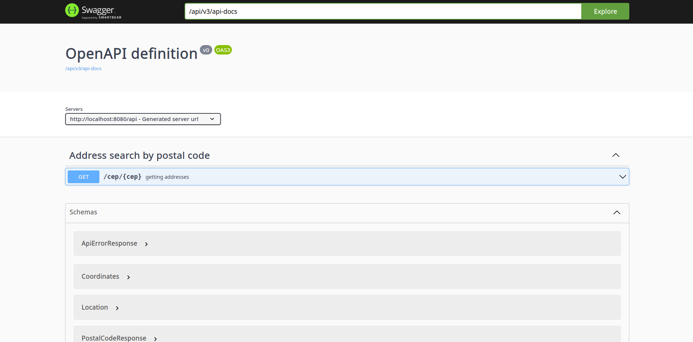
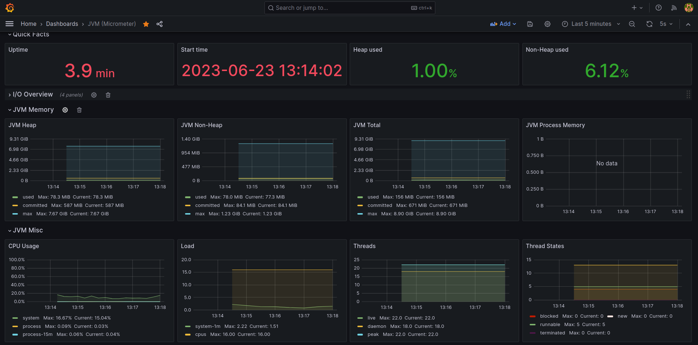
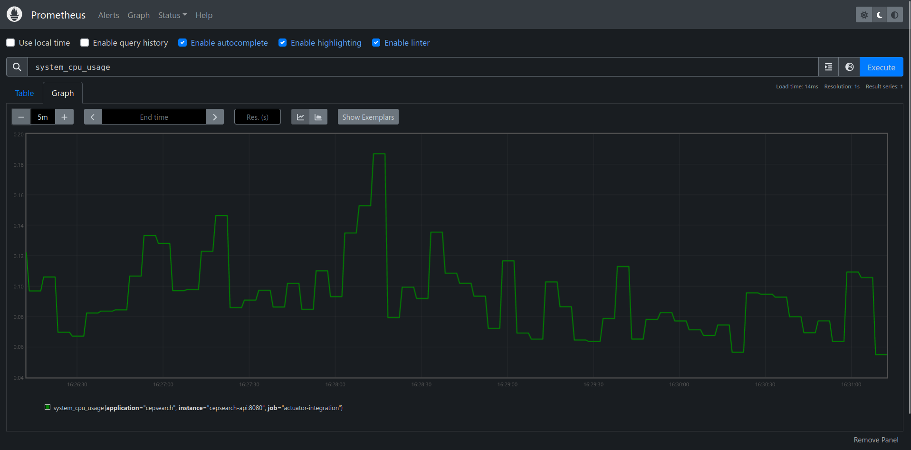

<h1 align="center">
   CEPSEARCH
</h1>

API developed for consumption of BrasilAPI. In it, OpenFeign was used to integrate REST Clients. An in-memory database
for caching, Redis, was also used. Along with other technologies like Docker and the docker-compose plugin. The API also
relies on swagger-ui for documentation and easy visualization of how the API works. It also uses Actuator and
Prometheus, which integrate with Grafana to view metrics and reports in graphs. Was
developed to practice programming and to study. Everything was integrated with the github workflow, to generate the
docker image build and send them to dockerhub

**You can access the API in production through the endpoint, deployed in AWS EC2**
**https://api.weverson.dev/api/cep/{any-postalcode}**

**To consume on a website with front-end, use the link below**
**https://cepsearch.weverson.dev**

## Technologies

- [Spring Boot](https://spring.io/projects/spring-boot)
- [Spring MVC](https://docs.spring.io/spring-framework/reference/web/webmvc.html)
- [Spring Cloud](https://spring.io/projects/spring-cloud)
- [SpringDoc OpenAPI 3](https://springdoc.org/)
- [Redis](https://redis.io/docs/about/)
- [Nginx](https://nginx.org/en/docs/)
- [Actuator](https://spring.io/guides/gs/actuator-service/)
- [Prometheus](https://prometheus.io/docs/prometheus/latest/getting_started/)
- [Grafana](https://grafana.com/docs/grafana/latest/)
- [Docker](https://docs.docker.com/get-started/)
- [Github Workflow](https://docs.github.com/en/actions/using-workflows)
- [AWS](https://docs.aws.amazon.com/)

## Practices adopted

- SOLID
- API REST
- Dependency Injection
- Automated tests
- Containerization with docker
- Data Caching
- Error response handling
- Full API monitoring
- Automatic Swagger Generation with OpenAPI 3

## Requirements

1. [Docker](https://docs.docker.com/engine/install/)
2. [Docker-compose](https://docs.docker.com/compose/)

## Get started

0.  Clone git repository

        git clone https://github.com/weversonl/cepsearch.git
        cd cepsearch

### Running the application with docker-compose

1.  Start with docker-compose

        docker compose -f docker/docker-compose.yml up -d

2.  If you want to view the interactive swagger, access the url below in your browser

        http://localhost:8080/api/swagger-ui/index.html#/ #### TODO EDITAR E VALIDAR

3.  Make a search by sending the desired zip code as Path Param, in your desired client. Below I leave an example [httpie](https://httpie.io)

        $ http GET :9999/api/cep/17560-246

        {
            "cep": "17560246",
            "state": "SP",
            "city": "Vera Cruz",
            "street": "Avenida Paulista",
            "neighborhood": "CECAP",
            "location": {
                "type": "Point",
                "coordinates": {
                    "longitude": null,
                    "latitude": null
                }
            }
        }

## Screenshot

## Monitoring

### With Grafana

1.  To monitor using Grafana, you can access the URL below. Using admin/admin
    credentials. [They can be changed after the first login]

         http://localhost:3000/

### With Prometheus

1.  To monitor using Prometheus, you can access the URL below.

        http://localhost:9090/

### With Actuator

1.  To get information with actuator, make a request to the following endpoint

        http://localhost:8080/api/actuator

## Other information

1.  To terminate and destroy the containers, you can run

        docker-compose down

⚠️ Still in development

## License

`cepsearch` is [MIT licensed](LICENSE).
